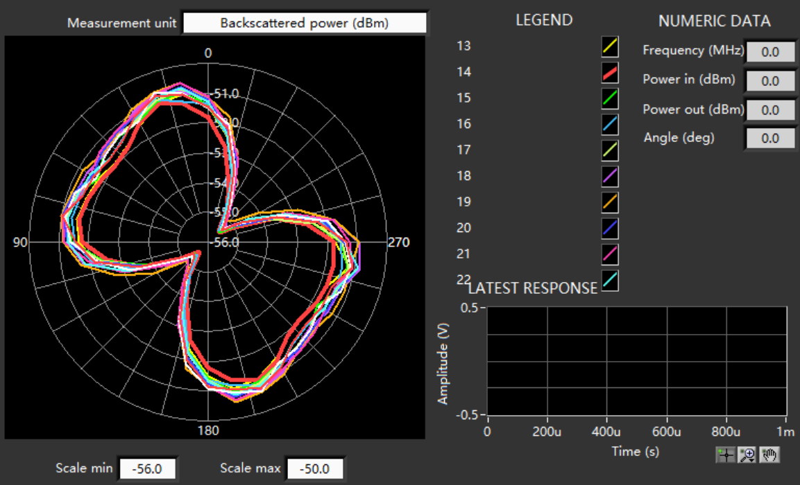

# RFID Indoor Localization Dataset for WhereRU System

## Overview

This dataset supports research on privacy-sensitive indoor localization using RFID technology, specifically for the "WhereRU" system - a novel multimodal indoor localization system that integrates RFID with ultrasonic technologies through a hierarchical fusion framework. It contains RSSI (Received Signal Strength Indicator) values collected from a grid of passive RFID tags when a person stands at different locations with different orientations, enabling high-precision localization while preserving privacy.

## Data Collection Setup

<div align="center">
  <div style="display: flex; justify-content: center; gap: 20px;">
    
    
  </div>
  <p><em>Left: Experimental setup photo. Right: Top-view diagram of the 2m × 2m experimental area.</em></p>
</div>

### Experimental Setup

Our experiment is designed to evaluate privacy-preserving indoor localization capabilities. The setup consists of a 2m × 2m area divided into 16 equal positions (50cm × 50cm each). An RFID reader with a 4-antenna array captures signals from a carefully curated grid of passive tags, leveraging the human occlusion effect to achieve high-accuracy grid-level localization.

The experimental setup shown above illustrates:

- A 2m × 2m area divided into 16 equal grid cells (50cm × 50cm each)
- Positions numbered from 1 to 16, starting from the bottom-left (Position_1) to the top-right (Position_16)
- Human subject positions with four orientation directions (Front, Back, Left, Right)
- RFID antennas strategically positioned to maximize signal diversity

### Hardware
- **RFID Reader**: Impinj R420 with a 4-antenna array
- **RFID Tags**: Impinj H47 passive tags, quality-controlled through rigorous tag filtering
- **Tag Arrangement**: 8×8 grid (64 tags) with 20cm spacing between tags (approximating half-wavelength of UHF RFID signals at 915 MHz to optimize spatial diversity while minimizing mutual coupling effects)
- **Experimental Area**: 2m × 2m square divided into 16 equal positions (0.5m × 0.5m each)
- **Ultrasonic Sensors**: Installed to maintain environmental consistency during data collection (measurements reserved for real-time localization experiments only)

### Tag Quality Control

<div align="center">
  
  <p><em>Backscattered power patterns across different RFID tags. The polar plot shows signal strength (dBm) distribution across 360 degrees.</em></p>
</div>

We implemented a comprehensive quality control process during data preprocessing to ensure measurement reliability. Through analysis of backscattered power patterns across 360 degrees, we identified and eliminated tags with inconsistent or anomalous response characteristics (such as tag #14 shown in red in the figure above). This rigorous selection process established a uniform signal quality baseline across our experimental grid, minimizing hardware-induced variations and allowing our subsequent analysis to focus exclusively on position-dependent signal patterns.

### Collection Methodology
- Volunteers stood in the center of each grid cell facing four distinct orientations (front, back, left, right)
- Additional individuals moved freely in the background to introduce realistic environmental interference
- For each position-orientation combination, we recorded RSSI values from all 64 selected tags via the 4-antenna array
- Each sample consists of a 4-channel 8×8 matrix (4 antennas × 64 tags)
- Missing values from intermittent read failures were addressed through efficient neighbor-based interpolation

### Dataset Size
- Approximately 1,600 samples per grid cell
- **Total samples**: 25,600
- **Features per sample**: 4×8×8 = 256 RSSI values

## Data Format

### Raw Data Format
The raw data is organized using the following naming convention:
- `X.Y (Z).csv` where:
  - `X` represents the position number (1-16)
  - `Y` represents the orientation (1=front, 2=back, 3=left, 4=right)
  - `Z` represents the collection round number

For example:
- `1.1 (2).csv` contains data from position 1, facing front (orientation 1), collection round 2
- `2.3 (5).csv` contains data from position 2, facing left (orientation 3), collection round 5

### Processed Data Format
- **Processed NumPy files**: `.npy` files containing processed RSSI matrices
- Each sample provides a 4-channel 8×8 RSSI matrix representing readings from all antennas for the entire tag grid
- The dataset leverages the human occlusion effect, where a person's presence systematically alters RSSI values

## Preprocessing Pipeline

The data processing pipeline includes:
1. Reading raw CSV files from the RFID reader
2. Extracting tag_id, antenna_id, and RSSI values
3. Organizing data into rounds of measurements
4. Skipping initial rounds to ensure signal stability
5. Creating 4×8×8 feature matrices (4 antennas, 8×8 tag grid)
6. Identifying and handling missing values through neighborhood-based interpolation

## Directory Structure

```
RFID_Dataset/
├── raw_data/                  # Raw CSV files from RFID reader (organized by position)
│   ├── 1.rar                  # Raw data for position 1
│   │   ├── 1.1.csv        # Position 1, orientation front, round 1
│   │   ├── 1.1 (2).csv        # Position 1, orientation front, round 2
│   │   ├── 1.1 (3).csv        # Position 1, orientation back, round 3
│   │   └── ...
│   ├── 2.rar                  # Raw data for position 2
│   ├── 3.rar                  # Raw data for position 3
│   ├── 4.rar                  # Raw data for position 4
│   ├── ...
│   ├── 10.rar                 # Raw data for position 10
│   ├── 11.rar                 # Raw data for position 11
│   ├── ...
│   └── 16.rar                 # Raw data for position 16
├── processed_RFID_data/       # Processed .npy files
│   ├── 1.1.npy                # Processed data for position 1, orientation front
│   ├── 1.2.npy                # Processed data for position 1, orientation back
│   ├── ...
│   └── 16.4.npy               # Processed data for position 16, orientation right
├── merged_RFID_data/          # Merged datasets by position
│   ├── 1_merged.npy           # Merged data for position 1 (all orientations)
│   ├── 2_merged.npy           # Merged data for position 2 (all orientations)
│   ├── ...
│   └── 16_merged.npy          # Merged data for position 16 (all orientations)
├── scripts/                   # Processing scripts
│   ├── process_raw.py         # Script for processing raw CSV data
│   └── merge_data.py          # Script for merging processed files
├── processed_RFID_data.rar    # Compressed archive containing all processed data
├── merged_RFID_data.rar       # Compressed archive containing all merged data
├── LICENSE                    # License file
├── README.md                  # Project documentation
├── experimental_setup.png     # Image showing the experimental setup
├── topview_diagram.png        # Top view diagram of the experimental area
└── backscattered_power.png    # Visualization of tag response pattern analysis
```

## Usage Examples

```python
import numpy as np
import matplotlib.pyplot as plt

# Load a processed dataset file
data = np.load('merged_RFID_data/1_merged.npy')

# Display information about the dataset
print(f"Dataset shape: {data.shape}")
print(f"Number of samples: {data.shape[0]}")
print(f"Feature dimensions: {data.shape[1:]} (antennas × rows × columns)")

# Visualize RSSI values from the first antenna for a sample
plt.figure(figsize=(8, 6))
plt.imshow(data[0, 0], cmap='viridis')
plt.colorbar(label='RSSI (dBm)')
plt.title('RSSI Values from First Antenna')
plt.xlabel('Tag Column')
plt.ylabel('Tag Row')
plt.show()
```

## Data Processing Scripts

### `process_raw.py` (Data Processing Script)
This script transforms raw CSV data from the RFID reader into structured NumPy arrays:
- Extracts tag_id, antenna_id, and RSSI values
- Organizes readings into measurement rounds
- Creates 4-dimensional feature matrices (samples × antennas × grid_rows × grid_cols)
- Handles missing RSSI readings through neighborhood interpolation

### `merge_data.py` (Data Merging Script)
This script combines processed files from multiple collection sessions:
- Groups files by location category
- Concatenates data from the same location
- Creates consolidated datasets for each position

## Citation

If you use this dataset in your research, please cite our paper:

```
Liu, W., Wang, S., Zhang, J., Bai, G., Pan, B., Wang, S., & Li, J. (2025). 
WhereRU: A Multimodal Indoor Localization System via Deep Learning-Based RFID and Ultrasonic Fusion. 
[Under Review]
```

## License

This dataset and associated code are made available under the MIT License.

## Contact

For questions about the dataset, please contact:
- Wenrui Liu: liuwenrui@iie.ac.cn
- Siye Wang (Corresponding author): wangsiye@iie.ac.cn

---

**Note**: This dataset accompanies a paper currently under review. The full citation information and additional documentation will be updated upon publication.
