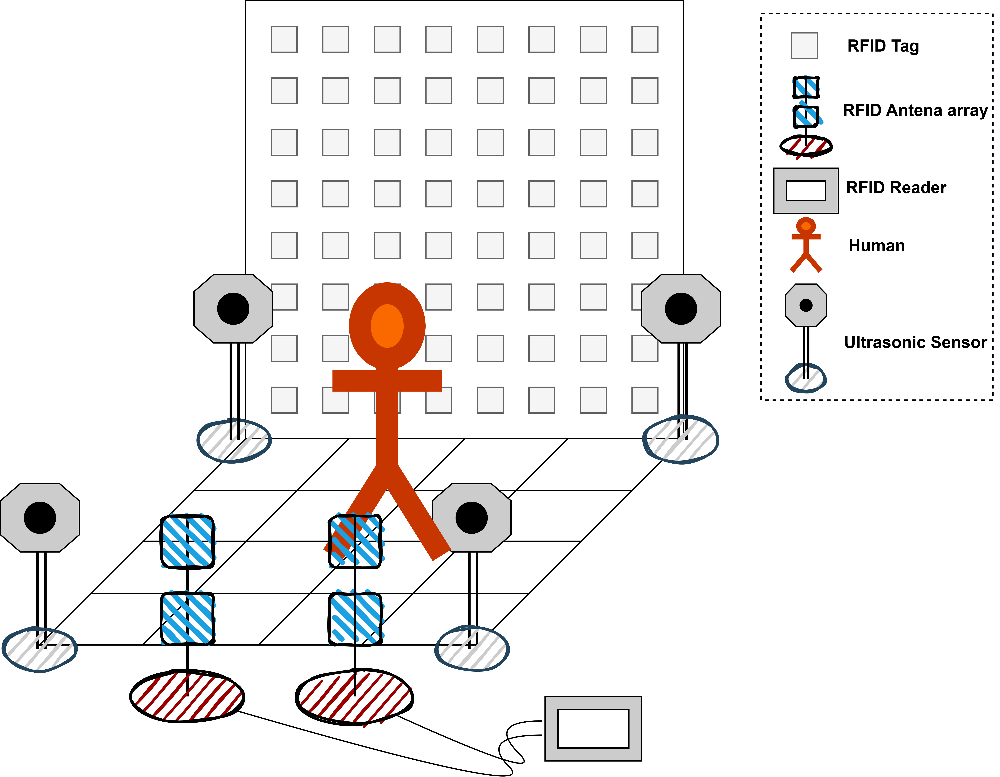

# RFID Indoor Localization Dataset

## Overview

This dataset supports research on privacy-sensitive indoor localization using RFID technology, specifically for the "WhereRU" system. It contains RSSI (Received Signal Strength Indicator) values collected from a grid of passive RFID tags when a person stands at different locations with different orientations.

## Data Collection Setup

<div align="center">
  <div style="display: flex; justify-content: center; gap: 20px;">
    
    
  </div>
  <p><em>Left: Experimental setup photo. Right: Top-view diagram of the 2m × 2m experimental area.</em></p>
</div>

### Experimental Setup

Our experiment is designed to evaluate the accuracy of RFID-based indoor localization. The setup consists of a 2m × 2m grid area divided into 16 equal positions (50cm × 50cm each). Two RFID antenna arrays are placed at the bottom of the experimental area to capture signals.

The experimental setup shown above illustrates:

- A 2m × 2m grid divided into 16 positions (50cm × 50cm each)
- Positions numbered from 1 to 16, starting from the bottom-left (Position_1) to the top-right (Position_16)
- Human subject positions with directional indicators (Front, Back, Left, Right)
- Two RFID antenna arrays placed at the bottom for RF signal data collection

### Position Mapping

The positions are mapped as follows:

| Row 4 (Top)    | Position_13 | Position_14 | Position_15 | Position_16 |
|----------------|-------------|-------------|-------------|-------------|
| **Row 3**      | Position_9  | Position_10 | Position_11 | Position_12 |
| **Row 2**      | Position_5  | Position_6  | Position_7  | Position_8  |
| **Row 1 (Bottom)** | Position_1  | Position_2  | Position_3  | Position_4  |

Each position generates unique RF signal patterns that are used for training and testing our localization algorithms.

### Hardware
- **RFID Reader**: Impinj R420 with a 4-antenna array
- **RFID Tags**: Impinj H47 passive tags
- **Tag Arrangement**: 8×8 grid (64 tags) with 20cm spacing between tags (approximating half-wavelength of UHF RFID signals at 915 MHz)
- **Experimental Area**: 2m × 2m square divided into 16 equal grids (0.5m × 0.5m each)

### Collection Methodology
- Volunteers stood in the center of each grid cell facing four different orientations (front, back, left, right)
- Background movement was introduced to create realistic interference
- Ultrasonic sensors were installed during data collection to maintain environmental consistency
- For each position-orientation combination, RSSI values were collected from all 64 tags via the 4-antenna array
- Each sample consists of a 4-channel 8×8 matrix (4 antennas × 64 tags)

### Dataset Size
- Approximately 1,600 samples per grid cell
- **Total samples**: 25,600
- **Features per sample**: 4×8×8 = 256 RSSI values

## Data Format

### Raw Data Format
The raw data is organized using the following naming convention:
- `X.Y (Z).csv` where:
  - `X` represents the position number (1-16)
  - `Y` represents the orientation (1=front, 2=back, 3=left, 4=right)
  - `Z` represents the collection round number

For example:
- `1.1 (2).csv` contains data from position 1, facing front (orientation 1), collection round 2
- `2.3 (5).csv` contains data from position 2, facing left (orientation 3), collection round 5

### Processed Data Format
- **Processed NumPy files**: `.npy` files containing processed RSSI matrices
- Each sample contains RSSI readings from all 4 antennas for the 8×8 grid of tags
- The dataset leverages the human occlusion effect, where a person's presence alters RSSI values

## Preprocessing

The data processing pipeline includes:
1. Reading raw CSV files from the RFID reader
2. Extracting tag_id, antenna_id, and RSSI values
3. Organizing data into rounds of measurements
4. Skipping the first two rounds to ensure stability
5. Creating 4×8×8 feature matrices (4 antennas, 8×8 tag grid)
6. Handling missing values through interpolation based on neighboring tag readings

## Directory Structure

```
RFID_Dataset/
├── raw_data/              # Raw CSV files from RFID reader
│   ├── 1.1 (1).csv        # Position 1, orientation front, round 1
│   ├── 1.1 (2).csv        # Position 1, orientation front, round 2
│   ├── ...
│   ├── 16.4 (5).csv       # Position 16, orientation right, round 5
├── processed_RFID_data        # Processed .npy files
│   ├── 1.1.npy            # Processed data for position 1, orientation front
│   ├── 1.2.npy            # Processed data for position 1, orientation back
│   ├── ...
│   ├── 16.4.npy           # Processed data for position 16, orientation right
├── merged_RFID_data           # Merged datasets by position
│   ├── 1_merged.npy       # Merged data for position 1 (all orientations)
│   ├── 2_merged.npy       # Merged data for position 2 (all orientations)
│   ├── ...
│   ├── 16_merged.npy      # Merged data for position 16 (all orientations)
├── scripts/               # Processing scripts
│   ├── process_raw.py     # Script for processing raw CSV data
│   └── merge_data.py      # Script for merging processed files
├── sample_data/           # Small sample datasets for quick testing
│   ├── raw_sample.csv     # Sample of raw data
│   └── processed_sample.npy # Sample of processed data
└── README.md              # This documentation file
```

## Usage Examples

```python
import numpy as np
import matplotlib.pyplot as plt

# Load a processed dataset file
data = np.load('merged_RFID_data/1_merged.npy')

# Display information about the dataset
print(f"Dataset shape: {data.shape}")
print(f"Number of samples: {data.shape[0]}")
print(f"Feature dimensions: {data.shape[1:]} (antennas × rows × columns)")

# Visualize RSSI values from the first antenna for a sample
plt.figure(figsize=(8, 6))
plt.imshow(data[0, 0], cmap='viridis')
plt.colorbar(label='RSSI (dBm)')
plt.title('RSSI Values from First Antenna')
plt.xlabel('Tag Column')
plt.ylabel('Tag Row')
plt.show()
```

## Data Processing Code

The repository includes the following processing scripts:

### `process_raw.py` (Data Processing Script)
This script transforms raw CSV data from the RFID reader into structured NumPy arrays:
- Extracts tag_id, antenna_id, and RSSI values
- Organizes readings into measurement rounds
- Creates 4-dimensional feature matrices (samples × antennas × grid_rows × grid_cols)
- Handles missing RSSI readings through neighborhood interpolation

### `merge_data.py` (Data Merging Script)
This script combines processed files from multiple collection sessions:
- Groups files by location category
- Concatenates data from the same location
- Creates consolidated datasets for each position

## Temporary Citation

This dataset is currently unpublished. If you use this dataset before publication, please contact the authors for appropriate citation information.

## License

This dataset and associated code are made available under the MIT License.

## Contact

For questions about the dataset, please contact:
liuwenrui@iie.ac.cn

---

**Note**: This dataset accompanies a paper currently under review. The full citation information and additional documentation will be updated upon publication.
